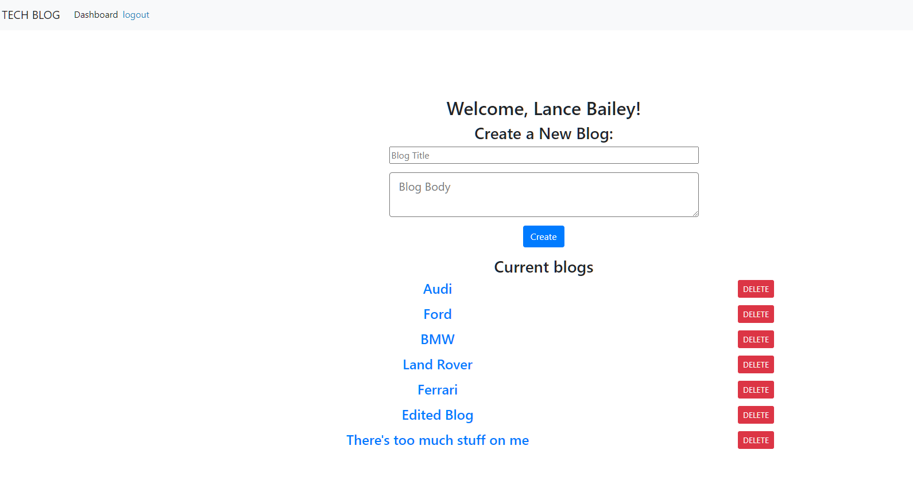

# techBlog

## Description

A website using standard MVC construction to allow users to blog and comment on blogs. Includes a MySql database for blogs/comments/users, and a sign in session/user accounts feature. 

---
## Future Developments

I'd like to not have delete buttons render if the object doesn't belong to the current user. Currently it just gives an error if you'd try and interact with something that doesn't belong to you.

--- 

## https://frozen-crag-95995.herokuapp.com/



--- 

## Installation

```npm-i``` to install all necessary packages, then create the database and seed it with by using the included ```db/schema.sql``` and ```seeds/index.js``` files.

--- 

## Usage

Create/Read/Update/Delete  accounts, blogs, comments using built in functions on the website.

## Credits

n/a

## Copyright Lance Bailey 08/09/2021 License: MIT License